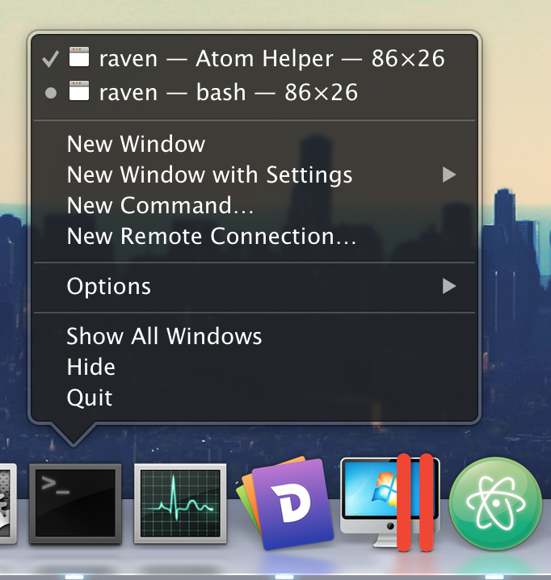
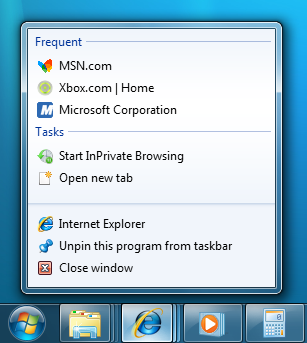
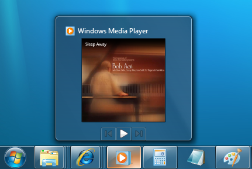

# 2.桌面环境整合

> 原文：https://github.com/electron/electron/blob/master/docs/tutorial/desktop-environment-integration.md   
译者：[Lin](https://github.com/ShmilyLin)   

不同的操作系统为集成桌面应用程序到它们的桌面环境提供了不同的特性。例如，Windows系统中，应用程序可以在任务栏的跳转列表中放置它们的快捷方式，Mac系统中，应用程序可以在dock菜单中放置一个自定义的菜单。   

本篇指南将讲解如何使用Electron接口集成你的应用程序到这些桌面环境中。   

## 通知（Windows, Linux, macOS）   

三个操作系统都给提供了应用程序发送给用户通知的方法。Electron是非常方便的允许开发者使用[HTML5的Notification接口](https://notifications.spec.whatwg.org/)发送通知，然后使用当前操作系统的原生通知接口展示通知。   

**注意：**因为这是一个HTML5接口，所以他只在渲染进程中有效。   

    let myNotification = new Notification('Title', {
        body: 'Lorem Ipsum Dolor Sit Amet'
    })

    myNotification.onclick = () => {
        console.log('Notification clicked')
    }

虽然代码和跨操作系统的用户体验是相同，但是它们有着细微的差别。   

### Windows   

 * Windows 10操作系统中，notifications “just work”。   
 * Windows 8.1和Windows 8操作系统中，你的应用程序的一个包含一个[Application User Model ID](https://msdn.microsoft.com/en-us/library/windows/desktop/dd378459(v=vs.85).aspx)的快捷方式必须安装到开始屏幕上。注意，它不一定要被固定在开始屏幕上。   
 * Windows 7操作系统中，通知是不被支持的。然而你可以使用[Tray API](https://electron.atom.io/docs/api/tray#traydisplayballoonoptions-windows)发送“balloon notifications”。   

此外，通知主体的最大长度是250个字符，Windows团队建议通知应该保持在200个字符以内。   

### Linux     

通知使用`libnotify`发送，它可以将通知显示在任何一个桌面环境中，遵循[Desktop Notifications Specification](https://developer.gnome.org/notification-spec/)，包括了Cinnamon、Enlightenment、Unity、GNOME、KDE。   

### macOS   

通知在macOS中是直截了当的，然而你需要了解[Apple’s Human Interface guidelines regarding notifications](https://developer.apple.com/library/mac/documentation/UserExperience/Conceptual/OSXHIGuidelines/NotificationCenter.html)。

请注意，通知长度仅限于256字节大小——如果你超过了这个限制它将会被截断。   

## 最近的文件   

Windows和macOS提供简单方便访问最近打开的文件的列表，应用分别通过跳转列表和dock菜单进入。   

**JumpList：**

**Application dock menu：**

添加一个文件到最近文件列表，你可以使用[app.addRecentDocument](../APIs/main/app.md#appaddrecentdocumentpath-macoswindows)接口：   

    const {app} = require('electron')
    app.addRecentDocument('/Users/USERNAME/Desktop/work.type')

你可以使用[app.clearRecentDocuments](../APIs/main/app.md#appclearrecentdocuments-macoswindows)接口清空最近文件列表：   

    const {app} = require('electron')
    app.clearRecentDocuments()

### Windows中的注意事项    

为了能够在Windows使用使用这个特性，你的应用程序需要被注册为一个处理文件的程序，否则即使你添加文件，文件也不会被展示在跳转列表中。你可以在[Application Registration](http://msdn.microsoft.com/en-us/library/windows/desktop/ee872121(v=vs.85).aspx)中找到任何关于注册你的应用程序的信息。   

当一个用户从跳转列表中点击一个文件，一个你的应用程序的新的实例将会被启动，这个文件路径将作为一个命令行参数添加到你的应用程序中。   

### MacOS注意事项    

当一个文件从最近文件列表中请求，`app`中的`open-file`事件接口将会被激活。   

## 自定义Dock菜单（MacOS）   

MacOS 允许开发人员在dock上指定一个包含了一些你的应用程序常用的功能的自定义菜单：   

**Terminal.app的Dock菜单：**

你可以使用`app.dock.setMenu`接口设置你的自定义dock菜单，这只能在MacOS上显示：   

    const {app, Menu} = require('electron')

    const dockMenu = Menu.buildFromTemplate([
        {label: 'New Window', click () { console.log('New Window') }},
        {label: 'New Window with Settings',
            submenu: [
                {label: 'Basic'},
                {label: 'Pro'}
            ]
        },
        {label: 'New Command...'}
    ])
    app.dock.setMenu(dockMenu)

## 用户任务（Windows）   

Windows中你可以在跳转列表的`Tasks`部分中指定自定义事件，引用MSDN：   

> Applications define tasks based on both the program’s features and the key things a user is expected to do with them. Tasks should be context-free, in that the application does not need to be running for them to work. They should also be the statistically most common actions that a normal user would perform in an application, such as compose an email message or open the calendar in a mail program, create a new document in a word processor, launch an application in a certain mode, or launch one of its subcommands. An application should not clutter the menu with advanced features that standard users won’t need or one-time actions such as registration. Do not use tasks for promotional items such as upgrades or special offers.   

It is strongly recommended that the task list be static. It should remain the same regardless of the state or status of the application. While it is possible to vary the list dynamically, you should consider that this could confuse the user who does not expect that portion of the destination list to change.

**Internet Explorer的Tasks：**

不像在macOS下dock菜单是一个真正的菜单，Windows中用户任务更像一个应用程序快捷方式，当用户点击一个任务，一个程序将接收到指定的参数来执行。   

你可以使用[app.setUserTasks](../APIs/main/app.md#appsetusertaskstasks-windows)接口来为你的应用程序设置用户任务：   

    const {app} = require('electron')
    app.setUserTasks([
        {
            program: process.execPath,
            arguments: '--new-window',
            iconPath: process.execPath,
            iconIndex: 0,
            title: 'New Window',
            description: 'Create a new window'
        }
    ])

清理你的任务列表只需要调用`app.setUserTasks`赋值一个空的数组就可以：   

    const {app} = require('electron')
    app.setUserTasks([])

即使你的应用程序关闭了，用户任务也仍然会显示，所以任务中的图标和程序路径在你的应用程序被写在之前一直存在。   

## 缩略图工具栏（Windows）   

Windows中你可以在应用窗口的任务栏布局中添加一个带有指定按钮的缩略图工具栏。它提供给用户在不用还原或激活窗口的情况下，一个进入一个详细的窗口命令的方法。   

MSDN中是这样说明的：   

> This toolbar is simply the familiar standard toolbar common control. It has a maximum of seven buttons. Each button’s ID, image, tooltip, and state are defined in a structure, which is then passed to the taskbar. The application can show, enable, disable, or hide buttons from the thumbnail toolbar as required by its current state.   

For example, Windows Media Player might offer standard media transport controls such as play, pause, mute, and stop.

**Windows Media Player的缩略图工具栏：**

你可以使用[BrowserWindow.setThumbarButtons](../APIs/main/BrowserWindow.md#winsetthumbarbuttonsbuttons-windows)在你的应用程序中设置缩略图工具栏：   

    const {BrowserWindow} = require('electron')
    const path = require('path')

    let win = new BrowserWindow({
        width: 800,
        height: 600
    })

    win.setThumbarButtons([
        {
            tooltip: 'button1',
            icon: path.join(__dirname, 'button1.png'),
            click () { console.log('button1 clicked') }
        },
        {
            tooltip: 'button2',
            icon: path.join(__dirname, 'button2.png'),
            flags: ['enabled', 'dismissonclick'],
            click () { console.log('button2 clicked.') }
        }
    ])

清空缩略图工具栏只需要调用`BrowserWindow.setThumbarButtons`接口并传入一个空的数组：   

    const {BrowserWindow} = require('electron')
    let win = new BrowserWindow()
    win.setThumbarButtons([])

## Unity Launcher Shortcuts (Linux)   

Unity中，你可以通过修改`.desktop`文件添加自定义entries到它自己的启动器中，详情请见[Adding Shortcuts to a Launcher](https://help.ubuntu.com/community/UnityLaunchersAndDesktopFiles#Adding_shortcuts_to_a_launcher)。   

**Launcher shortcuts of Audacious：**

## 任务栏中的进度条   

Windows中一个任务栏上的按钮可以被用来展示一个进度条。这使得一个窗口可以提供进度信息给用户，而无需用户切换到窗口本身。   
MacOS中将会被展示为dock图标的一部分。   

Unity DE也同样有一个类似允许你在启动器中设置进度条的功能。   

**任务栏中的进度条：**

你可以使用[BrowserWindow.setProgressBar](../APIs/main/BrowserWindow.md#winsetprogressbarprogress-options)接口来给一个窗口设置进度条：   

    const {BrowserWindow} = require('electron')
    let win = new BrowserWindow()
    win.setProgressBar(0.5)

## 任务栏的图标覆盖（Windows）    

Windows中一个任务栏上的按钮可以用一个小的重叠状态来展示应用状态，MSDN中是这样说明的：

> Icon overlays serve as a contextual notification of status, and are intended to negate the need for a separate notification area status icon to communicate that information to the user. For instance, the new mail status in Microsoft Outlook, currently shown in the notification area, can now be indicated through an overlay on the taskbar button. Again, you must decide during your development cycle which method is best for your application. Overlay icons are intended to supply important, long-standing status or notifications such as network status, messenger status, or new mail. The user should not be presented with constantly changing overlays or animations.

**任务栏的图标覆盖：**

你可以使用[BrowserWindow.setOverlayIcon](../APIs/main/BrowserWindow.md#winsetoverlayiconoverlay-description-windows)接口来为一个窗口设置重叠图标：   

    const {BrowserWindow} = require('electron')
    let win = new BrowserWindow()
    win.setOverlayIcon('path/to/overlay.png', 'Description for overlay')

## 闪烁框架（Windows）   

Windows中你可以高亮任务栏按钮来获得用户的关注。这类似于在MacOS中dock上图标的弹跳。MSDN的文档参考：   

> Typically, a window is flashed to inform the user that the window requires attention but that it does not currently have the keyboard focus.

你可以使用[BrowserWindow.flashFrame](../APIs/main/BrowserWindow.md#winflashframeflag)接口来设置任务栏按钮的闪烁状态：   

    const {BrowserWindow} = require('electron')
    let win = new BrowserWindow()
    win.once('focus', () => win.flashFrame(false))
    win.flashFrame(true)

不要忘记调用`flashFrame`方法设置为`false`来关闭闪烁。上面的示例中，当窗口获得焦点时它会被调用，但是你可能会使用一个延时时间或其他事件来禁用它。   

## 窗口的路径文件 (MacOS)     

MacOS中一个窗口可以设置它的路径文件，并且文件的图片可以展示在标题栏，当用户按Command键或者Control键时，一个快捷功能表将会展示在标题上。   

你也可以设置窗口的编辑状态以便文件图标可以指示窗口中的文档是否被修改。   

**Represented file popup menu：**

你可以使用[BrowserWindow.setRepresentedFilename](../APIs/main/BrowserWindow.md#winsetrepresentedfilenamefilename-macos)和[BrowserWindow.setDocumentEdited](../APIs/main/BrowserWindow.md#winsetdocumenteditededited-macos)接口来设置窗口路径文件：  

    const {BrowserWindow} = require('electron')
    let win = new BrowserWindow()
    win.setRepresentedFilename('/etc/passwd')
    win.setDocumentEdited(true)

## 将文件拖拽出窗口   

对于某些需要操作文件类型的应用，有很重要的功能室允许拖拽文件从Electron到其他应用。在你的应用中实现这个功能你需要在` ondragstart`事件中调用`webContents.startDrag(item)`接口。   

网页中：   

    <a href="#" id="drag">item</a>
    

主进程中：   

    const {ipcMain} = require('electron')
    ipcMain.on('ondragstart', (event, filePath) => {
        event.sender.startDrag({
            file: filePath,
            icon: '/path/to/icon.png'
        })
    })